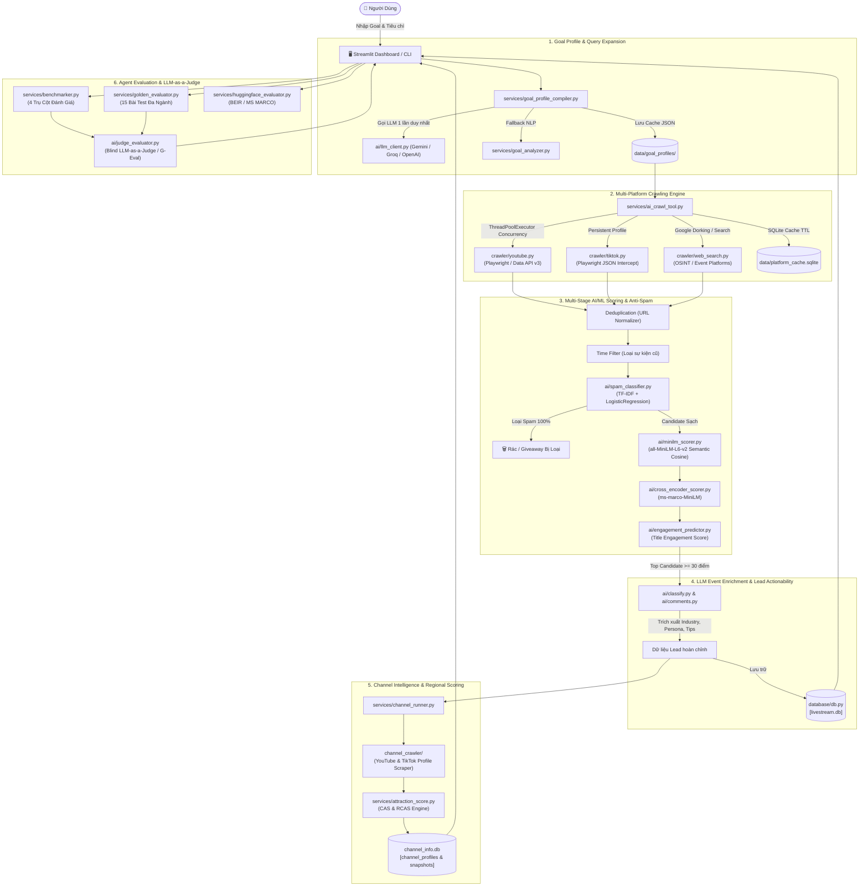
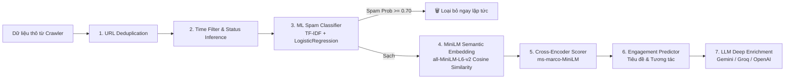
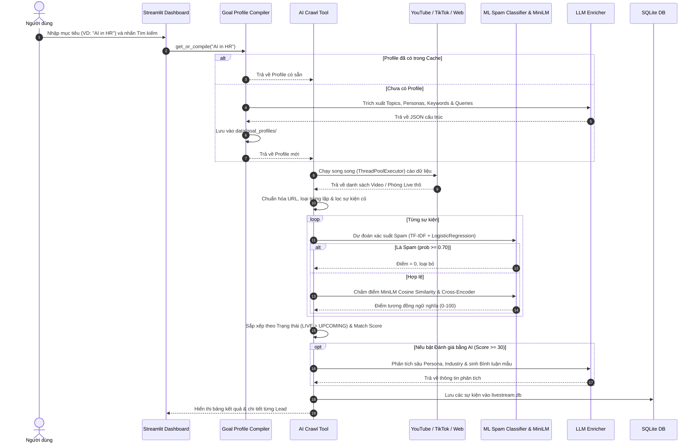
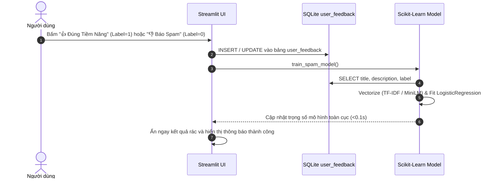
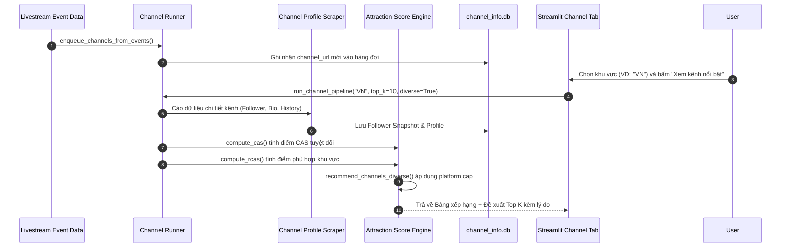
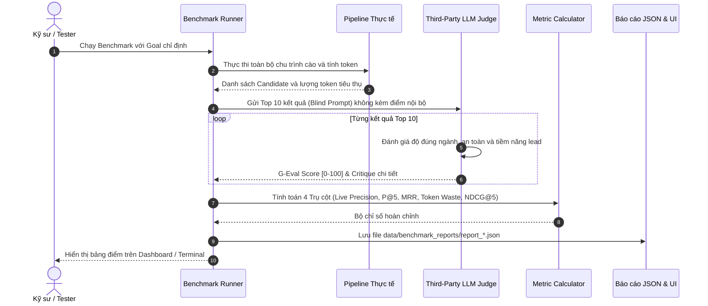

# 🎯 TÀI LIỆU KỸ THUẬT VÀ KIẾN TRÚC HỆ THỐNG
## AI Multi-Platform Livestream Finder & Agent Evaluator

---

## 📖 MỤC LỤC
1. [Tổng Quan Dự Án (Project Overview)](#1-tổng-quan-dự-án-project-overview)
2. [Kiến Trúc Tổng Thể (System Architecture)](#2-kiến-trúc-tổng-thể-system-architecture)
3. [Chi Tiết Các Thành Phần Cốt Lõi (Core Components)](#3-chi-tiết-các-thành-phần-cốt-lõi-core-components)
   - 3.1. [Tầng Thu Thập Đa Nền Tảng (Multi-Platform Crawler Layer)](#31-tầng-thu-thập-đa-nền-tảng-multi-platform-crawler-layer)
   - 3.2. [Động Cơ AI, NLP & Machine Learning (AI & ML Engine)](#32-động-cơ-ai-nlp--machine-learning-ai--ml-engine)
   - 3.3. [Hệ Thống Đánh Giá & Điểm Hấp Dẫn Kênh (Channel Attraction Score - CAS & RCAS)](#33-hệ-thống-đánh-giá--điểm-hấp-dẫn-kênh-channel-attraction-score---cas--rcas)
   - 3.4. [Khung Sát Hạch & Đánh Giá Agent (Agent Evaluation & Benchmarking)](#34-khung-sát-hạch--đánh-giá-agent-agent-evaluation--benchmarking)
   - 3.5. [Cơ Sở Dữ Liệu & Quản Lý Dữ Liệu (Database & Storage Engine)](#35-cơ-sở-dữ-liệu--quản-lý-dữ-liệu-database--storage-engine)
   - 3.6. [Giao Diện Dashboard & Điều Khiển (Streamlit UI)](#36-giao-diện-dashboard--điều-khiển-streamlit-ui)
4. [Quy Trình Hoạt Động Từng Luồng Dữ Liệu (Workflows)](#4-quy-trình-hoạt-động-từng-luồng-dữ-liệu-workflows)
   - 4.1. [Luồng Tìm Kiếm & Chấm Điểm Livestream (Search & Scoring Flow)](#41-luồng-tìm-kiếm--chấm-điểm-livestream-search--scoring-flow)
   - 4.2. [Luồng Thích Ứng Thời Gian Thực (Active Learning Feedback Flow)](#42-luồng-thích-ứng-thời-gian-thực-active-learning-feedback-flow)
   - 4.3. [Luồng Thu Thập & Đề Xuất Kênh Khu Vực (Channel Intelligence Pipeline)](#43-luồng-thu-thập--đề-xuất-kênh-khu-vực-channel-intelligence-pipeline)
   - 4.4. [Luồng Benchmark & Đánh Giá Giám Khảo Độc Lập (Evaluation & LLM Judge Flow)](#44-luồng-benchmark--đánh-giá-giám-khảo-độc-lập-evaluation--llm-judge-flow)
5. [Cấu Trúc Thư Mục Dự Án (Directory Structure)](#5-cấu-trúc-thư-mục-dự-án-directory-structure)
6. [Hướng Dẫn Cài Đặt & Vận Hành (Setup & Operation Guide)](#6-hướng-dẫn-cài-đặt--vận-hành-setup--operation-guide)

---

## 1. Tổng Quan Dự Án (Project Overview)

**AI Multi-Platform Livestream Finder & Agent Evaluator** là một hệ thống tác tử thông minh (AI Agent System) được thiết kế chuyên biệt cho việc **phát hiện khách hàng tiềm năng (Lead Discovery)**, **săn tìm sự kiện phát sóng trực tiếp (Livestreams, Webinars, Online Workshops, Networking Events)** và **xếp hạng kênh phân phối theo khu vực địa lý** trên các nền tảng lớn: **YouTube, TikTok và Web Search (Google Dorking OSINT)**.

### Mục tiêu cốt lõi:
- **Tự động hóa hoàn toàn chu trình tìm kiếm lead:** Từ mục tiêu kinh doanh tự nhiên của người dùng (ví dụ: *"B2B SaaS Founders in Vietnam"*, *"AI in Healthcare"*), hệ thống tự biên dịch từ khóa, cào dữ liệu, lọc rác/spam, tính toán độ liên quan và xuất kịch bản tương tác.
- **Loại bỏ lãng phí Token AI (Token Economy):** Tích hợp tầng lọc đa cấp (Rule-based Time Filtering $\to$ Scikit-Learn ML Spam Classifier $\to$ Local Sentence-Transformers MiniLM Embedding $\to$ Cross-Encoder) trước khi gọi các LLM API đắt đỏ, giúp tiết kiệm 70-90% token.
- **Cơ chế học chủ động (Active Learning):** Hệ thống tự động cập nhật mô hình Machine Learning ngay lập tức (<0.1 giây) khi người dùng vote Like/Dislike trên giao diện.
- **Đo lường & Sát hạch Agent chuẩn quốc tế (4 Pillars & LLM-as-a-Judge):** Tích hợp sẵn bộ đo lường hiệu năng scraper, độ chuẩn xác của Agent (Precision@5, MRR, MAP, NDCG@5), bộ đề thi sát hạch 15 ngành (Golden Benchmark Dataset) và đối chuẩn trực tiếp với Hugging Face Hub (BEIR / MS MARCO).

---

## 2. Kiến Trúc Tổng Thể (System Architecture)

Hệ thống hoạt động theo mô hình phân tầng hướng sự kiện (Multi-tier Pipeline):



---

## 3. Chi Tiết Các Thành Phần Cốt Lõi (Core Components)

### 3.1. Tầng Thu Thập Đa Nền Tảng (Multi-Platform Crawler Layer)
Tầng này chịu trách nhiệm thu thập thông tin livestream thực tế theo thời gian thực:

1. **YouTube Crawler ([`crawler/youtube.py`](file:///Volumes/Shared/File%20for%20Google%20Drive%20real/Project/LiveStreamAgentEvaluator/livestream-finder-analyse/crawler/youtube.py)):**
   - **Chế độ Playwright Scraper:** Điều khiển trình duyệt không giao diện (headless Chromium), điều hướng trang tìm kiếm YouTube với bộ lọc livestream (`sp=CAMSAkAB` cho LIVE hoặc `sp=CAMSAkAC` cho UPCOMING), trích xuất `title`, `channel_name`, `url`, `video_id`, số lượng người xem đồng thời (`concurrent_viewers`), huy hiệu `🔴 LIVE`.
   - **Chế độ YouTube Data API v3:** Sử dụng API chính thức của Google (`type=video`, `eventType=live` hoặc `upcoming`) khi người dùng truyền API key, hỗ trợ bóc tách metadata chính xác tuyệt đối.
2. **TikTok Live Crawler ([`crawler/tiktok.py`](file:///Volumes/Shared/File%20for%20Google%20Drive%20real/Project/LiveStreamAgentEvaluator/livestream-finder-analyse/crawler/tiktok.py)):**
   - TikTok chặn các truy vấn ẩn danh, do đó crawler sử dụng `Playwright persistent browser context` tải profile đã đăng nhập từ `data/browser_profile/` (được tạo qua [`crawler/session_login.py`](file:///Volumes/Shared/File%20for%20Google%20Drive%20real/Project/LiveStreamAgentEvaluator/livestream-finder-analyse/crawler/session_login.py)).
   - Lắng nghe và đánh chặn trực tiếp các phản hồi mạng nội bộ (Network Response Interception) từ API tìm kiếm JSON của TikTok để bóc tách thông tin phòng live, người phát sóng và số lượng người xem.
3. **Web Search Crawler ([`crawler/web_search.py`](file:///Volumes/Shared/File%20for%20Google%20Drive%20real/Project/LiveStreamAgentEvaluator/livestream-finder-analyse/crawler/web_search.py)):**
   - Khai thác kỹ thuật **Google Dorking OSINT** và các công cụ tìm kiếm DuckDuckGo / SearXNG / Eventbrite / Luma / Zoom Events / Meetup để săn tìm các link phát trực tiếp chưa được index trên nền tảng mạng xã hội.
4. **Channel Metadata Crawler ([`channel_crawler/`](file:///Volumes/Shared/File%20for%20Google%20Drive%20real/Project/LiveStreamAgentEvaluator/livestream-finder-analyse/channel_crawler)):**
   - Bóc tách chi tiết thông tin kênh từ YouTube (`youtube_channel.py`) và TikTok (`tiktok_channel.py`): số lượng người theo dõi (`follower_count`), lịch sử phát sóng (`activity_history`), thông tin liên hệ / shop bán hàng (`seller_info`), và ánh xạ khu vực qua `region_mapper.py`.

---

### 3.2. Động Cơ AI, NLP & Machine Learning (AI & ML Engine)



1. **Unified AI Client ([`ai/llm_client.py`](file:///Volumes/Shared/File%20for%20Google%20Drive%20real/Project/LiveStreamAgentEvaluator/livestream-finder-analyse/ai/llm_client.py)):**
   - Đóng gói giao tiếp với nhiều nhà cung cấp LLM: **Google Gemini (2.5-flash, 2.0-flash)** $\to$ **Groq (Llama-3.3-70b, Llama-3.1-8b)** $\to$ **OpenAI (GPT-4o-mini)**.
   - **Tự động Fallback:** Khi một provider gặp lỗi hết quota (`429 RESOURCE_EXHAUSTED` hoặc `rate_limit`), hệ thống tự động chuyển sang model hoặc provider kế tiếp mà không làm gián đoạn pipeline.
   - **Token Logger:** Ghi nhận từng request (prompt tokens, completion tokens, category, timestamp) vào `data/token_usage.log`.
2. **Machine Learning Spam Classifier ([`ai/spam_classifier.py`](file:///Volumes/Shared/File%20for%20Google%20Drive%20real/Project/LiveStreamAgentEvaluator/livestream-finder-analyse/ai/spam_classifier.py)):**
   - Mô hình phân loại rác học máy (TF-IDF N-grams 1-3 + Logistic Regression cân bằng trọng số lớp) được huấn luyện từ tập dữ liệu 1 triệu bình luận YouTube (`youtube_comment_sentiment.parquet`).
   - Nhận diện chính xác các video spam game (Free Robux, V-Bucks, Hack tool), spam tài chính lừa đảo (Crypto pump, CashApp giveaway) và gán `score = 0`.
3. **Cơ Chế Học Chủ Động Thời Gian Thực (Active Learning Feedback Engine):**
   - Khi người dùng bấm **👍 Đúng Tiềm Năng** hoặc **👎 Báo Spam / Rác** trên giao diện:
     - Dữ liệu được ghi vào bảng `user_feedback` trong SQLite.
     - Hàm `train_spam_model()` lập tức lấy mẫu và tái huấn luyện mô hình Scikit-Learn cục bộ chỉ trong **<0.1 giây**, cập nhật bộ phân loại ngay trong phiên làm việc.
4. **Mô Hình Semantic Similarity ([`ai/minilm_scorer.py`](file:///Volumes/Shared/File%20for%20Google%20Drive%20real/Project/LiveStreamAgentEvaluator/livestream-finder-analyse/ai/minilm_scorer.py)):**
   - Sử dụng `sentence-transformers/all-MiniLM-L6-v2` để vector hóa văn bản (Embedding) và tính toán khoảng cách Cosine giữa Tiêu đề + Mô tả của sự kiện với Mục tiêu tìm kiếm (Goal).
   - Tích hợp sẵn thuật toán dự phòng Hybrid N-gram TF-IDF & Containment Jaccard Matching khi thiết bị chưa tải xong mô hình.
5. **Zero-Shot Cross-Encoder ([`ai/cross_encoder_scorer.py`](file:///Volumes/Shared/File%20for%20Google%20Drive%20real/Project/LiveStreamAgentEvaluator/livestream-finder-analyse/ai/cross_encoder_scorer.py)):**
   - Sử dụng mô hình `cross-encoder/ms-marco-MiniLM-L-6-v2` chấm điểm độ tương thích ngữ nghĩa sâu giữa cặp câu `(Goal, Event Text)` theo chuẩn trích xuất thông tin.
6. **Mô Hình Phân Tích Sự Kiện Chuyên Sâu ([`ai/classify.py`](file:///Volumes/Shared/File%20for%20Google%20Drive%20real/Project/LiveStreamAgentEvaluator/livestream-finder-analyse/ai/classify.py)):**
   - Gọi LLM trích xuất cấu trúc JSON: Lĩnh vực ngành nghề (`industry`), Chân dung người tham gia (`buyer_persona`), Điểm số độ khớp (`score`), Mẹo tiếp cận cuộc trò chuyện (`interaction_tip`), và Bình luận mẫu tự nhiên để tương tác (`suggested_comment`).

---

### 3.3. Hệ Thống Đánh Giá & Điểm Hấp Dẫn Kênh (Channel Attraction Score - CAS & RCAS)
Được triển khai trong [`services/attraction_score.py`](file:///Volumes/Shared/File%20for%20Google%20Drive%20real/Project/LiveStreamAgentEvaluator/livestream-finder-analyse/services/attraction_score.py), đánh giá tiềm năng của từng kênh theo 2 tầng:

#### Tầng 1: Điểm Hấp Dẫn Tuyệt Đối (CAS - Channel Attraction Score $\in [0, 100]$)
Công thức kết hợp 5 chỉ số có trọng số:
$$\text{CAS} = \sum (\text{Component}_i \times \text{Weight}_i) \times 10$$
- **Audience ($30\%$):** Quy mô người theo dõi (thang Logarit) + Tốc độ tăng trưởng 7 ngày / 30 ngày.
- **Activity ($25\%$):** Tần suất phát sóng hàng tuần ($70\%$) + Tổng số buổi livestream trong lịch sử ($30\%$).
- **Engagement ($25\%$):** Tỷ lệ người xem trực tiếp trên số lượng follower (Viewer-to-Follower Rate).
- **Recency ($15\%$):** Suy giảm theo thời gian kể từ buổi live gần nhất (Step-decay).
- **Commerce ($5\%$):** Tín hiệu bán hàng, chứng nhận Verified, thông tin shop, email liên hệ.

Phân tầng (Tiers):
- 🔥 **Hot:** $\ge 80$
- ⭐ **Promising:** $\ge 60$
- 📈 **Growing:** $\ge 40$
- 💤 **Passive:** $\ge 20$
- ❌ **Stale:** $< 20$

#### Tầng 2: Điểm Hấp Dẫn Khu Vực (RCAS - Regional CAS $\in [0, 100]$)
$$\text{RCAS} = \text{CAS} \times \text{Regional\_Relevance}$$
Trong đó `Regional_Relevance` $\in [0.1, 1.0]$ được tính dựa trên:
- **Location Score ($0 - 0.6$):** Trùng khớp mã vùng (ví dụ: `VN-HN`, `VN-HCM`) hoặc cùng quốc gia (`VN`).
- **Language Score ($0 - 0.3$):** Ngôn ngữ kênh khớp với ngôn ngữ chính thống của khu vực (ví dụ: Tiếng Việt `vi` cho `VN`).
- **Content Score ($0 - 0.1$):** Chứa các từ khóa địa danh, thành phố đặc trưng trong tên/mô tả kênh.

**Thuật toán Đề xuất Đa dạng hóa (Platform Diversification):**
Trong hàm `recommend_channels_diverse()`, hệ thống tự động giới hạn số lượng kênh tối đa cho mỗi nền tảng $\le \lceil \text{Top\_K} / 2 \rceil$ để đảm bảo người dùng nhận được nguồn lead cân bằng giữa YouTube và TikTok.

---

### 3.4. Khung Sát Hạch & Đánh Giá Agent (Agent Evaluation & Benchmarking)

Hệ thống cung cấp khung sát hạch toàn diện 3 cấp độ:

```
┌────────────────────────────────────────────────────────────────────────┐
│               ⚡ KHUNG SÁT HẠCH TOÀN DIỆN NĂNG LỰC AGENT                │
├──────────────────────────┬─────────────────────────┬───────────────────┤
│ 1. CUSTOM GOAL BENCHMARK │ 2. GOLDEN BENCHMARK (15)│ 3. HUGGING FACE   │
│ (Mục tiêu tự chọn)       │ (Bộ đề chuẩn đa ngành)  │ (BEIR / MS MARCO) │
├──────────────────────────┴─────────────────────────┴───────────────────┤
│                     4 TRỤ CỘT ĐÁNH GIÁ KỸ THUẬT                        │
│ 1. Scraper Performance  2. Relevance Quality 3. Token Economy 4. Leads │
├────────────────────────────────────────────────────────────────────────┤
│          🏛️ BAN GIÁM KHẢO AI ĐỘC LẬP (LLM-AS-A-JUDGE / G-EVAL)         │
│          • G-Eval Quality Score [0-100]  • NDCG@5 Search Ranking       │
└────────────────────────────────────────────────────────────────────────┘
```

1. **4 Trụ Cột Kỹ Thuật ([`services/benchmarker.py`](file:///Volumes/Shared/File%20for%20Google%20Drive%20real/Project/LiveStreamAgentEvaluator/livestream-finder-analyse/services/benchmarker.py)):**
   - **Pillar 1: Hiệu năng Scraper & Nhận Diện Live (Playwright Live Detection):**
     - $\text{Live Precision} = \frac{\text{TP}_{\text{live}}}{\text{TP}_{\text{live}} + \text{FP}_{\text{live}}} \times 100\%$ *(Tỷ lệ bắt đúng livestream/upcoming không bị lẫn video tĩnh)*
     - $\text{Live Recall} = \frac{\text{TP}_{\text{live}}}{\text{TP}_{\text{live}} + \text{FN}_{\text{live}}} \times 100\%$ *(Độ phủ số lượng livestream tìm được so với chỉ tiêu)*
     - $\text{Live F1-Score} = 2 \times \frac{\text{Precision} \times \text{Recall}}{\text{Precision} + \text{Recall}}$ *(Điểm điều hòa cân bằng giữa độ chính xác và độ phủ)*
     - `Field Completeness` (độ đầy đủ các trường dữ liệu), `Throughput` (tốc độ bóc tách items/giây), `Average Latency`.
   - **Pillar 2: Chất Lượng Phù Hợp & AI (Relevance & Lead Quality):**
     - $\text{Relevance Precision} = \frac{\text{TP}_{\text{rel}}}{\text{TP}_{\text{rel}} + \text{FP}_{\text{rel}}} \times 100\%$ *(Tỷ lệ lead thực sự khớp mục tiêu)*
     - $\text{Relevance Recall} = \frac{\text{TP}_{\text{rel}}}{\text{TP}_{\text{rel}} + \text{FN}_{\text{rel}}} \times 100\%$ *(Độ thu hồi lead tiềm năng)*
     - $\text{Relevance F1-Score} = 2 \times \frac{\text{Precision} \times \text{Recall}}{\text{Precision} + \text{Recall}}$ *(Điểm F1 đánh giá chất lượng phân loại)*
     - `Precision@5`, `Precision@10`, `Spam Leakage Rate` (tỷ lệ lọt rác), `MRR` (Mean Reciprocal Rank - vị trí của kết quả chuẩn đầu tiên).
   - **Pillar 3: Kinh Tế Token & Tiết Kiệm (Token Economy):** Đo lường chi tiết lượng token hữu ích vs token bị lãng phí do crawl trùng lặp, lọc thời gian hoặc chấm điểm sự kiện rác; tính `Token Efficiency %` và `Tokens / Useful Lead`.
   - **Pillar 4: Tính Hành Động Của Lead (Actionability):** `High Priority Ratio`, `Average Lead Score`.
2. **Ban Giám Khảo AI Độc Lập (Third-Party LLM-as-a-Judge / G-Eval - [`ai/judge_evaluator.py`](file:///Volumes/Shared/File%20for%20Google%20Drive%20real/Project/LiveStreamAgentEvaluator/livestream-finder-analyse/ai/judge_evaluator.py)):**
   - Sử dụng một LLM độc lập đóng vai trò giám khảo "chấm mù" (blind evaluation) từng video tìm được theo tiêu chí G-Eval (Độ đúng ngành nghề, Tính khả thi khi tiếp cận, Độ an toàn/không vi phạm thuần phong mỹ tục).
   - Tính toán chỉ số **NDCG@5 (Normalized Discounted Cumulative Gain)** đánh giá chất lượng thuật toán sắp xếp thứ hạng.
3. **Golden Benchmark Suite 15 Ngành ([`services/golden_evaluator.py`](file:///Volumes/Shared/File%20for%20Google%20Drive%20real/Project/LiveStreamAgentEvaluator/livestream-finder-analyse/services/golden_evaluator.py)):**
   - Bộ kiểm thử chuẩn hóa gồm 15 bài test thuộc nhiều lĩnh vực: *B2B SaaS, AI & ML, FinTech, Charity & Non-profit, DevOps, Cybersecurity, E-Commerce, v.v.*
4. **Hugging Face Hub Benchmark ([`services/huggingface_evaluator.py`](file:///Volumes/Shared/File%20for%20Google%20Drive%20real/Project/LiveStreamAgentEvaluator/livestream-finder-analyse/services/huggingface_evaluator.py)):**
   - Tải trực tiếp các tập dữ liệu trắc nghiệm chuẩn từ Hugging Face Hub (`BeIR/fiqa`, `BeIR/scifact`, `BeIR/trec-covid`, `microsoft/ms_marco`, `BeIR/quora`) và so sánh đối chứng năng lực trích xuất của Agent với chuẩn tìm kiếm truyền thống **BM25 Baseline** (`+30% đến +60% improvement`).

---

### 3.5. Cơ Sở Dữ Liệu & Quản Lý Dữ Liệu (Database & Storage Engine)

Hệ thống sử dụng kiến trúc hai cơ sở dữ liệu SQLite chuyên biệt ([`database/db.py`](file:///Volumes/Shared/File%20for%20Google%20Drive%20real/Project/LiveStreamAgentEvaluator/livestream-finder-analyse/database/db.py)):

| Cơ sở dữ liệu | Bảng (Table) | Mục đích sử dụng |
| :--- | :--- | :--- |
| **`livestream.db`** | `livestreams` | Lưu trữ toàn bộ sự kiện livestream đã cào, bóc tách trạng thái, điểm số, ngành nghề, buyer persona, bình luận gợi ý. |
| | `user_feedback` | Lưu trữ lịch sử nhãn Like (1) / Dislike (0) của người dùng để phục vụ Active Learning. |
| **`channel_info.db`** | `channel_profiles` | Lưu trữ hồ sơ định danh kênh, số lượng người theo dõi, tỷ lệ tăng trưởng 7d/30d, số buổi live, vị trí địa lý, điểm CAS & RCAS. |
| | `follower_snapshots` | Lưu vết biến động số lượng người theo dõi theo thời gian (Time-series snapshots) để tính tốc độ tăng trưởng. |

Ngoài ra, hệ thống quản lý các tệp bộ nhớ đệm (Cache & Logs):
- `data/goal_profiles/*.json`: Cache các mục tiêu đã phân tích để tránh gọi LLM phân tích lại.
- `data/platform_cache.sqlite`: Cache kết quả cào thô theo nền tảng với cơ chế hết hạn TTL.
- `data/token_usage.log`: Ghi nhật ký token chi tiết từng miligiây.
- `data/benchmark_reports/*.json`: Lưu trữ các bản báo cáo sát hạch đánh giá.

---

### 3.6. Giao Diện Dashboard & Điều Khiển (Streamlit UI)

Được triển khai trong [`dashboard/streamlit_app.py`](file:///Volumes/Shared/File%20for%20Google%20Drive%20real/Project/LiveStreamAgentEvaluator/livestream-finder-analyse/dashboard/streamlit_app.py), gồm 5 tab chức năng chính:

1. **📋 Tổng quan (System Overview):** Thống kê số lượng event, điểm trung bình, phân bố nền tảng, mức độ ưu tiên (High/Medium/Low), trạng thái (LIVE/UPCOMING), và lịch sử các phiên auto-run.
2. **🔍 Tìm kiếm Livestream (Search & Lead Discovery):** Giao diện tìm kiếm theo mục tiêu, tùy chọn cào bằng Playwright / API, bộ lọc trạng thái, bảng kết quả chi tiết kèm nút **Active Learning Feedback (👍 Tiềm năng / 👎 Spam)**.
3. **📡 Kênh nổi bật (Channel Intelligence):** Xem bảng xếp hạng kênh theo từng quốc gia/khu vực (21+ khu vực: VN, TH, SG, US, JP, KR,...), xem biểu đồ RCAS Top 10, phân tích lý do đề xuất, và xuất file CSV/JSON.
4. **⚡ Benchmark & Token Waste (Agent Evaluation Center):**
   - *Sub-tab 1:* Đánh giá mục tiêu tùy chọn theo 4 trụ cột kỹ thuật & Giám khảo LLM-as-a-Judge.
   - *Sub-tab 2:* Chạy sát hạch trên bộ đề 15 ngành Golden Benchmark Dataset.
   - *Sub-tab 3:* Đánh giá so sánh trực tiếp trên Dataset Hugging Face (BEIR & MS MARCO).
5. **🤖 Trạng thái AI & Token Tracker:** Kiểm tra tình trạng kết nối các khóa API (Gemini, Groq, OpenAI), xem biểu đồ và lịch sử tiêu thụ token theo thời gian thực.

---

## 4. Quy Trình Hoạt Động Từng Luồng Dữ Liệu (Workflows)

### 4.1. Luồng Tìm Kiếm & Chấm Điểm Livestream (Search & Scoring Flow)



---

### 4.2. Luồng Thích Ứng Thời Gian Thực (Active Learning Feedback Flow)



---

### 4.3. Luồng Thu Thập & Đề Xuất Kênh Khu Vực (Channel Intelligence Pipeline)



---

### 4.4. Luồng Benchmark & Đánh Giá Giám Khảo Độc Lập (Evaluation & LLM Judge Flow)



---

## 5. Cấu Trúc Thư Mục Dự Án (Directory Structure)

```
livestream-finder-analyse/
├── ai/                                # 🧠 Động cơ Trí tuệ Nhân tạo & Machine Learning
│   ├── classify.py                    # Phân tích sự kiện bằng LLM & fallback NLP
│   ├── comments.py                    # Sinh bình luận tương tác tự nhiên trong livestream
│   ├── cross_encoder_scorer.py        # Chấm điểm độ tương thích bằng Cross-Encoder
│   ├── engagement_predictor.py        # Dự đoán mức độ tương tác từ tiêu đề
│   ├── judge_evaluator.py             # Ban giám khảo AI độc lập (LLM-as-a-Judge / G-Eval)
│   ├── llm_client.py                  # Client đa nhà cung cấp (Gemini / Groq / OpenAI) + Token Log
│   ├── minilm_scorer.py               # Mô hình nhúng ngữ nghĩa all-MiniLM-L6-v2
│   ├── spam_classifier.py             # Bộ phân loại Spam ML (TF-IDF + LogisticRegression + Active Learning)
│   └── train_supercharged_spam_model.py # Script huấn luyện mô hình spam từ tập dữ liệu lớn
│
├── crawler/                           # 🌐 Tầng thu thập dữ liệu sự kiện Livestream
│   ├── _browser.py                    # Trình quản lý Chromium / Playwright Browser Context
│   ├── session_login.py               # Công cụ đăng nhập tương tác & lưu phiên TikTok
│   ├── tiktok.py                      # Crawler TikTok Live (Persistent context & API interception)
│   ├── web_search.py                  # Crawler Web Search (Google Dorking OSINT, Eventbrite, Zoom)
│   └── youtube.py                     # Crawler YouTube Live (Playwright Scraper + Data API v3)
│
├── channel_crawler/                   # 📡 Tầng thu thập hồ sơ kênh phát sóng (Channel Intelligence)
│   ├── _utils.py                      # Tiện ích chuẩn hóa tên kênh, follower, parsing số liệu
│   ├── region_mapper.py               # Bộ từ điển & quy tắc ánh xạ quốc gia, ngôn ngữ, vùng miền
│   ├── tiktok_channel.py              # Bóc tách thông tin profile và phòng live TikTok
│   ├── web_channel.py                 # Thu thập thông tin kênh từ web
│   └── youtube_channel.py             # Bóc tách thông tin kênh YouTube (About, Subscribers, Videos)
│
├── services/                          # ⚙️ Logic nghiệp vụ và các dịch vụ điều phối
│   ├── ai_crawl_tool.py               # Điều phối cào dữ liệu song song, lọc thời gian & tính điểm
│   ├── attraction_score.py            # Động cơ tính điểm CAS (tuyệt đối) & RCAS (khu vực)
│   ├── auto_runner.py                 # Dịch vụ tự động chạy ngầm theo chu kỳ
│   ├── benchmarker.py                 # Động cơ đo lường 4 trụ cột & lãng phí token
│   ├── channel_runner.py              # Điều phối pipeline phân tích và đề xuất kênh
│   ├── goal_analyzer.py               # Phân tích mục tiêu dự phòng không dùng LLM
│   ├── goal_profile_compiler.py       # Biên dịch mục tiêu thành Profile tìm kiếm & lưu cache
│   ├── golden_evaluator.py            # Bộ sát hạch 15 bài test chuẩn đa ngành (Golden Dataset)
│   └── huggingface_evaluator.py       # Bộ đánh giá so sánh trực tiếp trên Hugging Face Hub (BEIR)
│
├── dashboard/                         # 🖥️ Giao diện người dùng
│   └── streamlit_app.py               # Ứng dụng Streamlit Dashboard đa chức năng
│
├── database/                          # 🗄️ Cấu trúc cơ sở dữ liệu và Data Access Objects
│   ├── db.py                          # Schema SQLAlchemy cho livestream.db và channel_info.db
│   ├── livestream_repository.py       # Thao tác CRUD sự kiện livestream & thống kê
│   └── channel_repository.py          # Thao tác CRUD hồ sơ kênh & follower snapshot
│
├── data/                              # 📂 Lưu trữ dữ liệu, mô hình, log và cache
│   ├── goal_profiles/                 # Các file JSON lưu cache Goal Profile
│   ├── models/                        # File nhị phân mô hình ML đã train (spam_classifier_v2.pkl)
│   ├── benchmark_reports/             # Các báo cáo đánh giá benchmark được lưu dưới dạng JSON
│   ├── browser_profile/               # Phiên đăng nhập Playwright cho TikTok
│   ├── platform_cache.sqlite          # Bộ nhớ đệm dữ liệu cào thô
│   └── token_usage.log                # Nhật ký tiêu thụ Token AI chi tiết
│
├── tools/                             # 🛠️ Các công cụ hỗ trợ phân tích và vẽ biểu đồ
│   ├── plot_benchmark_comparison.py   # Vẽ biểu đồ so sánh hiệu năng các nền tảng
│   ├── plot_title_likes_correlation.py# Phân tích tương quan giữa tiêu đề và tương tác
│   └── pull_sentiment_dataset.py      # Tải dataset bình luận để huấn luyện ML
│
├── auto_crawl.py                      # Script CLI chạy tự động cào dữ liệu định kỳ
├── benchmark.py                       # Script CLI chạy benchmark và đo lường token
├── eval_agent_benchmark.py            # Script CLI chạy bài thi sát hạch Agent
├── track_tokens.py                    # Script CLI theo dõi lượng tiêu thụ token theo thời gian thực
├── Benchmark_Analysis.ipynb           # Jupyter Notebook phân tích sâu toàn bộ dữ liệu đánh giá
├── run.command                        # 🍎 File nhấp đúp (Double-click) tự động chạy trên macOS
├── run.bat                            # 🪟 File nhấp đúp (Double-click) tự động chạy trên Windows
├── run.sh                             # 🐧 Script chạy trên terminal Linux / macOS
└── requirements.txt                   # Danh sách thư viện phụ thuộc Python
```

---

## 6. Hướng Dẫn Cài Đặt & Vận Hành (Setup & Operation Guide)

### 6.1. Yêu Cầu Môi Trường
- **Hệ điều hành:** macOS, Linux hoặc Windows 10/11.
- **Python:** Phiên bản `>= 3.9` (Khuyên dùng Python 3.10 hoặc 3.11).
- **Trình duyệt Chromium (Playwright):** Cần thiết cho việc cào dữ liệu YouTube và TikTok.

### 6.2. Cài Đặt Thư Viện

```bash
# 1. Tạo và kích hoạt môi trường ảo
python3 -m venv .venv
source .venv/bin/activate  # Trên macOS/Linux
# .venv\Scripts\activate   # Trên Windows

# 2. Cài đặt các gói phụ thuộc
pip install -r requirements.txt

# 3. Cài đặt trình duyệt Playwright Chromium
python -m playwright install chromium
```

### 6.3. Cấu Hình Biến Môi Trường (`.env`)
Tạo file `.env` tại thư mục gốc với nội dung:

```env
# Khóa API AI (Cung cấp ít nhất 1 khóa, hệ thống sẽ tự động fallback)
GEMINI_API_KEY=AIzaSy...
GROQ_API_KEY=gsk_...
OPENAI_API_KEY=sk-...

# Tùy chọn YouTube Data API v3 (Nếu muốn dùng API thay vì Playwright Scraper)
YOUTUBE_API_KEY=AIzaSy...

# Cấu hình Cơ sở dữ liệu (Mặc định dùng SQLite cục bộ)
DATABASE_URL=sqlite:///livestream.db
```

### 6.4. Đăng Nhập Tài Khoản TikTok (Thiết lập một lần)
Để cào dữ liệu TikTok không bị chặn:
```bash
python -m crawler.session_login tiktok
```
*Cửa sổ trình duyệt sẽ mở ra trang đăng nhập TikTok. Sau khi đăng nhập thành công, nhấn Enter tại terminal để lưu session.*

---

### 6.5. Khởi Chạy Ứng Dụng

#### Cách 1: Khởi chạy Giao diện Dashboard (Khuyên dùng)
```bash
# Khởi chạy ứng dụng web Streamlit
streamlit run dashboard/streamlit_app.py
```
*Hoặc trên macOS nhấp đúp vào file `run.command` (trên Windows nhấp đúp vào `run.bat`).*

#### Cách 2: Chạy Benchmark & Sát hạch Agent qua CLI
```bash
# Chạy benchmark đánh giá với mục tiêu tùy chọn:
python benchmark.py --goal "B2B SaaS in Southeast Asia" --limit 10

# Chạy sát hạch trên bộ đề 15 ngành Golden Benchmark:
python eval_agent_benchmark.py

# Theo dõi tiêu thụ token AI thời gian thực:
python track_tokens.py

# Chạy tác vụ cào dữ liệu tự động ngầm:
python auto_crawl.py
```
